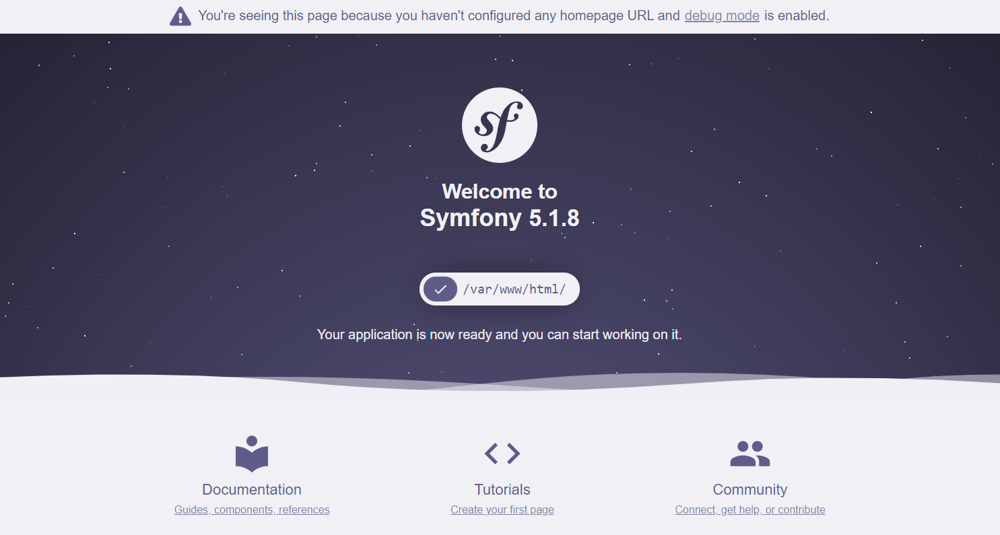
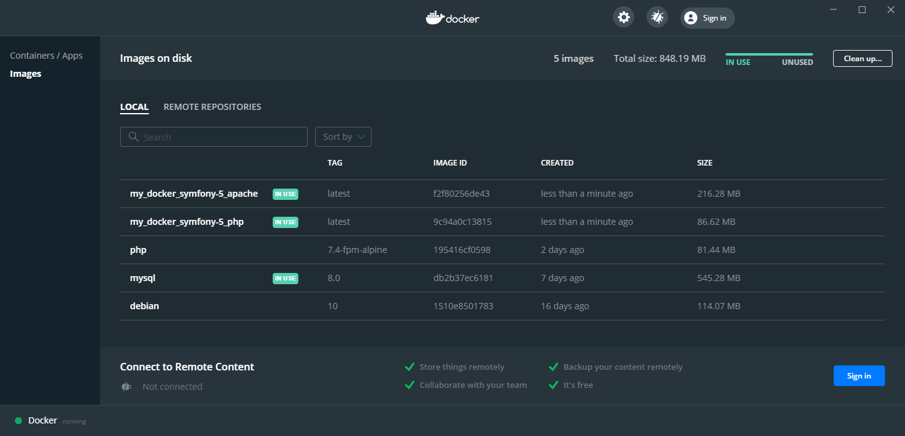
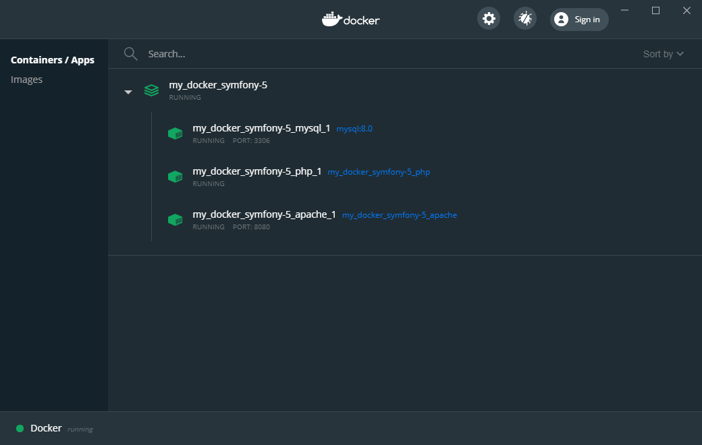

# Docker Symfony 5 starter kit 

This development stack includes Symfony 5/Webpack Encore, MySQL, Apache and PHP built with Docker containers using docker-compose tool.

## Services

- MySQL 8.0
- Apache
- PHP7-FPM 7.4

## Installation
1. Clone the repository, build services and create/Start containers:
```sh
$ git clone git@github.com:kyrog/bon_coin.git
$ cd bon_coin
$ docker-compose build
$ docker-compose up
$ composer install
 ----
$ php bin/console doctrine:migrations:migrate
--> this will build the BDD
$ php bin/console doctrine:fixtures:load
--> this will load data into the BDD
```

2. Visit http://127.0.0.1:8080/




3. Install additional frontend dependencies and watch for changes: 
```sh
$ docker-compose exec php yarn
$ docker-compose exec php yarn watch
```

4. Docker Dashboard main info: 




## Folders structure

```text
docker-symfony-5/
├─ .doc/
├─ .docker/
│ ├─ apache/
│ │   ├─ config/
│ │   └─ Dockerfile
│ ├─ mysql/
│ │   └─ config/
│ └─ php/
│     ├─ config/
│     │    └─ docker-entrypoint.sh
│     └─ Dockerfile
│ ...
│ ├─ .env
│ └─ docker-compose.yml
```

- .doc : documentation for this repository (images etc.), you can skip it completely
- .docker : folder containing Dockerfiles and additional information to run containers. Here is also stored the data of mounted service VOLUME (database files, logs etc.).
- .env : Symfony 5/Docker configuration file - feel free to change regarding your needs
- .docker-compose.yml : definition of multi-container Docker application


## Commands

```sh
# Docker
$ docker-compose up -d
$ docker-compose down
$ docker-compose up -d --no-deps --build mysql
$ docker-compose up -d --no-deps --build apache
$ docker-compose up -d --no-deps --build php
$ docker-compose exec php sh

# Symfony
$ docker-compose exec php php bin/console cache:clear

# Composer
$ docker-compose exec php composer install

# Yarn
$ docker-compose exec php yarn
$ docker-compose exec php yarn watch
```
# Launching the project 

```sh
# Docker
$ docker-compose up --build
$ docker exec -it my_docker_symfony-5_php_1 sh
```
